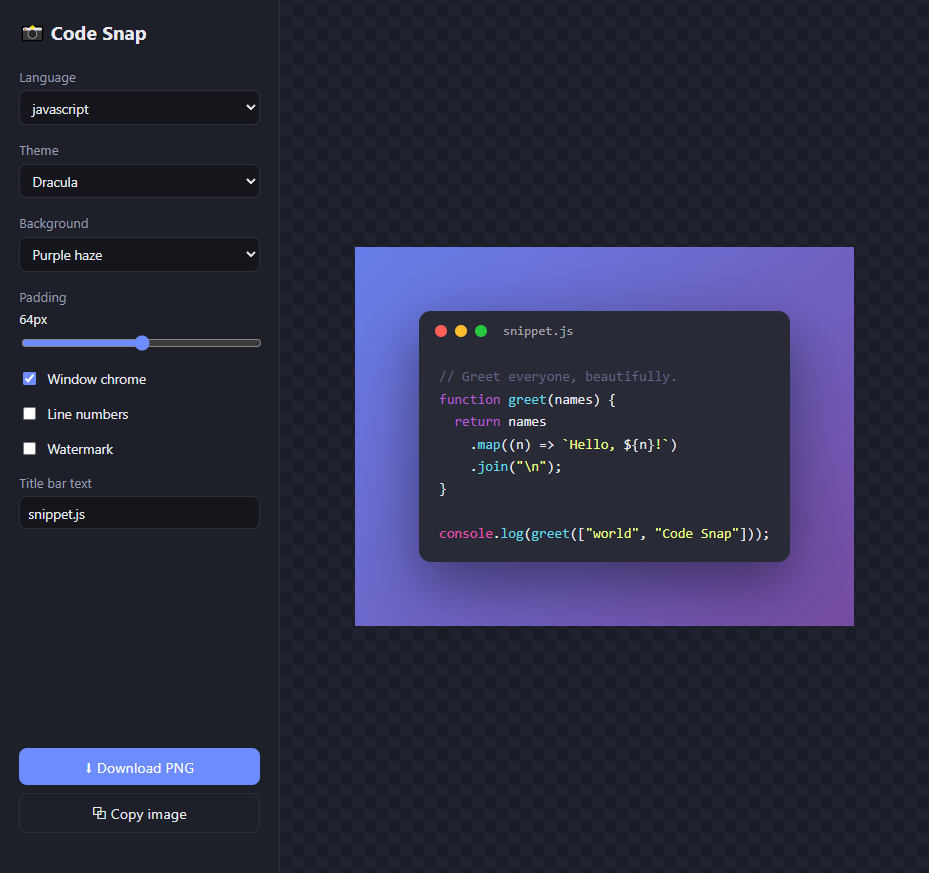

# 📸 Code Snap

Turn a code snippet into a **beautiful, shareable image** — syntax highlighting,
color themes, window chrome, gradient backgrounds. Export as PNG or copy
straight to your clipboard. **100% in the browser, no backend, nothing uploaded.**



## ✨ Features

- **Live, editable code** with real syntax highlighting (20+ languages)
- **7 themes** — Dracula, GitHub Dark/Light, Nord, One Dark, Tokyo Night, Solarized
- **Gradient / solid / transparent** backgrounds
- **Window chrome** with traffic-light dots + custom title bar
- **Adjustable padding**, optional **line numbers** and **watermark**
- **Export PNG** (2× resolution) or **copy image to clipboard**
- **Zero install** — just open `index.html`

## 🚀 Use it

**Live demo:** https://ccrumptonai.github.io/code-snap/

Or run locally:

```bash
git clone https://github.com/ccrumptonai/code-snap.git
cd code-snap
# open index.html in a browser
```

## 🧪 How it works

The editor uses an **overlay technique**: a transparent `<textarea>` sits on top
of a syntax-highlighted `<pre>`, so you type normally while the colored version
renders underneath. The styled frame is then snapshotted to PNG with
[html-to-image](https://github.com/bubkoo/html-to-image).

> Clipboard image copy uses the async Clipboard API and needs a modern browser
> (Chrome/Edge/Safari). PNG download works everywhere.

## 🛠️ Built with

- [highlight.js](https://highlightjs.org/) — syntax highlighting + themes
- [html-to-image](https://github.com/bubkoo/html-to-image) — DOM → PNG

## 📄 License

MIT
